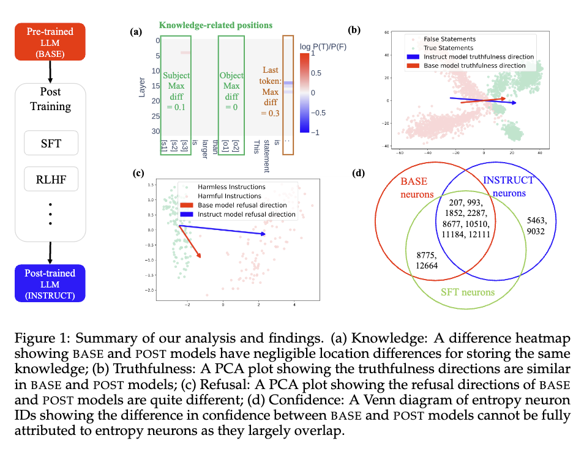

# Post-training Mechanistic Analysis
Code for the COLM 2025 paper: [How Post-Training Reshapes LLMs: A Mechanistic View on Knowledge, Truthfulness, Refusal, and Confidence](https://arxiv.org/abs/2504.02904)





## Setting Up

To run the code base, [nnsight](https://github.com/ndif-team/nnsight) and [TransformerLens](https://github.com/TransformerLensOrg/TransformerLens) need to be installed. 

For installing nnsight, directly run `pip install nnsight`.

For installing TransformerLens, we recommend installing the version in this code base by running `pip install -e ./TransformerLens`. 

For running experiments using models not currently included by TransformerLens, modify `./TransformerLens/transformer_lens/loading_from_pretrained.py`.

## Running Experiments

Knowledge and internal belief of truthfulness experiments are under `Knowledge+Truthfulness/`, Refusal direction experiments are under `Refusal/`, and entropy neuron related experiments are under `Confidence/`. Please check the README of each directory for how to run the code. 

## Citation

If you think our work is helpful please consider citing our paper:

```
@misc{du2025posttraining,
    title={How Post-Training Reshapes LLMs: A Mechanistic View on Knowledge, Truthfulness, Refusal, and Confidence},
    author={Hongzhe Du and Weikai Li and Min Cai and Karim Saraipour and Zimin Zhang and Himabindu Lakkaraju and Yizhou Sun and Shichang Zhang},
    year={2025},
    eprint={2504.02904},
    archivePrefix={arXiv},
    primaryClass={cs.CL}
}
```